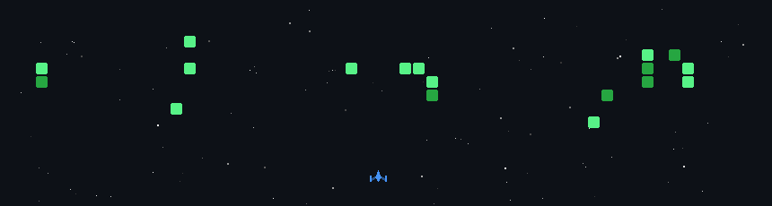
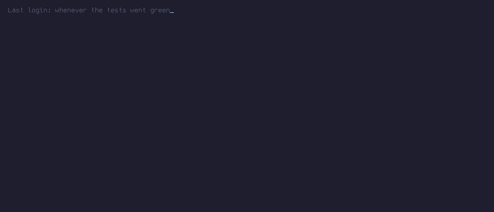

<picture>
  <source media="(prefers-color-scheme: dark)" srcset="https://readme-typing-svg.demolab.com?font=JetBrains+Mono&weight=800&size=46&duration=1800&pause=99999&color=E6EDF3&center=true&vCenter=true&repeat=false&width=700&height=72&lines=Arya+Prince" />
  <source media="(prefers-color-scheme: light)" srcset="https://readme-typing-svg.demolab.com?font=JetBrains+Mono&weight=800&size=46&duration=1800&pause=99999&color=0D1117&center=true&vCenter=true&repeat=false&width=700&height=72&lines=Arya+Prince" />
  
</picture>

**`backends`** · **`on-device ML`** · **`real-time vision`**

<picture>
  <source media="(prefers-color-scheme: dark)" srcset="https://readme-typing-svg.demolab.com?font=JetBrains+Mono&weight=600&size=17&pause=1400&color=58A6FF&center=true&vCenter=true&width=780&height=34&lines=POST+%2Fbookings+returns+409+on+overlap;An+atomic+SET+NX+claims+the+capture+before+the+PSP+call;INT8+quantization%3A+7.07+MB+to+3.69+MB%2C+top-1+parity+held;33+ms%2Fframe+at+1080p%2C+30+fps" />
  <source media="(prefers-color-scheme: light)" srcset="https://readme-typing-svg.demolab.com?font=JetBrains+Mono&weight=600&size=17&pause=1400&color=0969DA&center=true&vCenter=true&width=780&height=34&lines=POST+%2Fbookings+returns+409+on+overlap;An+atomic+SET+NX+claims+the+capture+before+the+PSP+call;INT8+quantization%3A+7.07+MB+to+3.69+MB%2C+top-1+parity+held;33+ms%2Fframe+at+1080p%2C+30+fps" />
  
</picture>

<!-- Keep each badge row on ONE source line. GFM turns a newline between inline
     elements into a  , which stacks the badges vertically. -->
  

  

 

## ~/now

- **CS 61A course staff**, UC Berkeley. 30+ students a week on interpreters, recursion, and environment diagrams.
- **Science and Beyond**, founder. AI and programming workshops for 100+ K-12 students.
- Third year, B.A. Data Science and Computer Science, May 2028. Berkeley, CA.

I mostly write backends and on-device ML, and I care about the parts that only show up when
something breaks: double bookings that return a 409, payment captures that stay single under
concurrency, models small enough to run with the network off.

## ~/recently

- **Parallax Defense** — software engineering intern, summer 2026. Real-time detection and
  tracking against a 33 ms/frame budget at 1080p/30fps. Wrote the detection-head decode and the
  IoU/CIoU/BCE losses in NumPy with 23 unit tests behind them, a socket-level egress guard armed
  before third-party imports that asserts zero non-loopback traffic, SHA-256 weight-integrity
  verification with tamper detection, and track-NMS for duplicate and ghost suppression.
- **Digital-twin sampling research** — CDSS, NIST-funded, spring 2026. Poisson-disk sampling with
  KDTree ball queries over TUM RGB-D scenes, swept across sampling radii and scored on 9 metrics.
  Cuts roughly 90% of point volume while holding coverage at 1.000, and ships an interactive HTML
  report the lab used to pick its operating point.
- **Technovation** — backend engineer on a 4-person team, spring 2026. Details below.

## ~/projects

| | What it is | Worth knowing |
|---|---|---|
| **[Relay](https://github.com/kingaryaprince/relay-travel-agent)** | Voice travel-disruption recovery agent. TypeScript, Next.js App Router, SSE streaming, 12 REST tool endpoints, and 5 role-specialized agent prompts that place outbound supplier calls. | The payment ledger claims each capture with an atomic Redis `SET NX` taken before the PSP call. 18 tests, including 10 concurrent captures that resolve to exactly one winner. Six provider adapters behind one interface plus a mock implementing the same contract, so it runs with no API keys. |
| **[On-Device Vision](https://github.com/kingaryaprince/on-device-vision)** | iOS image classifier. PyTorch MobileNetV2 converted to Core ML, SwiftUI camera app. | INT8 quantization took the model from 7.07 MB to 3.69 MB, a 1.92x cut, with top-1 parity verified. Fully offline, no network calls. |
| **[CropCast](https://github.com/ScienceAndBeyond/CropCast)** | Crop-yield prediction over 734 counties in 11 states, 2010–2024, joining USDA NASS QuickStats, gridMET, MODIS NDVI/EVI, and SoilGrids into 14 features across 6 crops. | Random Forest on an 80:20 temporal split (train 2010–2021, test 2022–2024) so no future year leaks backward. Corn hits test R² 0.764. A four-way ablation puts the mean relative test-R² gain from adding vegetation and soil over a climate-only baseline at 74% across the 6 crops. Presented at AGU 2025. |
| **[Technovation Backend](https://github.com/richahw/technovation-backend)** | FastAPI and PostgreSQL coaching platform built by a team of four. | 13 of the 26 REST endpoints, the 3-table schema, the webhook handlers, and both OAuth2 flows (Cal.com v2 and Google Calendar) with token refresh. `POST /bookings` returns 409 on overlap and degrades gracefully when Cal.com is down. |
| **[Wildfire Detection](https://github.com/kingaryaprince/wildfiredetect)** | Sentinel-2 wildfire detection, benchmarking a CNN, a lightweight CNN variant, and an SVM baseline against each other. | Scored on accuracy, precision, recall, F1, ROC-AUC, and confusion matrix, topping 85% accuracy, with DBSCAN collapsing repeat detections of the same fire. Funded by a $4.3k ESA Network of Resources grant. Presented at AGU 2023 with a TechRxiv preprint. |
| **[Science and Beyond](https://github.com/kingaryaprince/science-and-beyond-website)** | Site for the nonprofit. Next.js App Router with Sanity as a headless CMS. | Studio embedded at `/studio`, Portable Text rendering, and dynamic blog routes off the CMS, so the people writing the content never touch the repo. |
| **[Gradescope → Calendar](https://github.com/kingaryaprince/GradescopeGCALSync)** | Scrapes Gradescope and pushes new assignments into Google Calendar. | Selenium plus OAuth2, retry with backoff, driven from a CLI. Written because I kept missing deadlines. |

## ~/stack

**Languages**

**Backend & Data**

**Frontend**

**ML & Scientific**

**Tooling**

## ~/elsewhere

Two AGU presentations, a TechRxiv preprint, and an ESA-funded remote sensing project sit behind
the wildfire and CropCast work above. Reach me at
[aryaprince@berkeley.edu](mailto:aryaprince@berkeley.edu).
